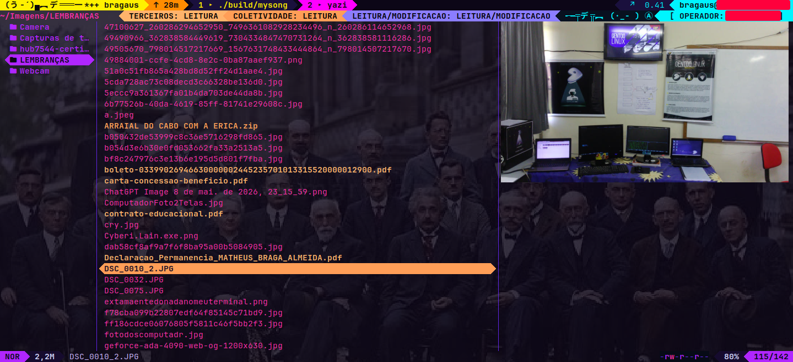

# y { comando ls do GNU/Linux Radical }

no radical basta digitar y e você vai ter um explorador de arquivos para terminal, com suporte a imagem, pdf, zip, rar; Estou pensando em juntar ele com o mysong o projeto da musica la pra ter um suporte a previsa de mp3 e mp4 e também estou com projetos para arrastar e soltar, veja as cenas nos proximos capitulos :)

  

